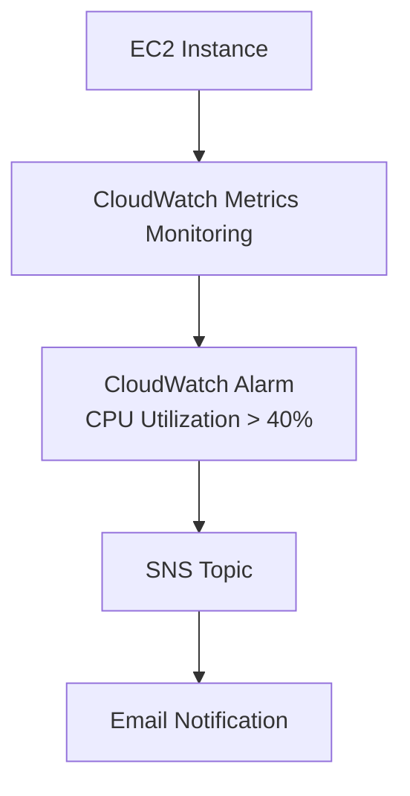
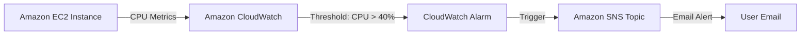

# AWS CloudWatch CPU Monitoring and Alerting Project

## Project Overview

This project demonstrates how to monitor the CPU utilization of an Amazon EC2 instance using AWS CloudWatch and configure automated email notifications when CPU usage exceeds a predefined threshold.

The objective is to proactively monitor server performance and receive alerts whenever CPU utilization becomes unusually high.

---

## Architecture





---

## Services Used

- Amazon EC2
- Amazon CloudWatch
- Amazon SNS (Simple Notification Service)

---

## Project Outcome

A short recording of the final results can be viewed here:

🎥 [Watch Result Recording](https://drive.google.com/file/d/1YRQAPII_bmQbbovIEz7f-08v-hbDZliW/view?usp=sharing)

---

## Project Steps

### Step 1: Launch an EC2 Instance

1. Log in to AWS Management Console.
2. Navigate to **EC2 Dashboard**.
3. Launch a new EC2 instance.
4. Configure:
   - AMI: Amazon Linux 2 / Ubuntu
   - Instance Type: t2.micro (Free Tier eligible)
   - Security Group: Allow SSH access
5. Connect to the instance using SSH.

Example:

```bash
ssh -i my-key.pem ec2-user@<public-ip>
```

---

### Step 2: Create CPU Load Generator Script

To simulate high CPU utilization, create a Python script named:

```bash
cpu_spike.py
```

Run the script:

```bash
python3 cpu_spike.py
```

This generates continuous CPU load on the EC2 instance.

---

### Step 3: Enable Detailed Monitoring

By default, CloudWatch collects metrics every 5 minutes.

To get more frequent updates:

1. Go to **EC2 Console**
2. Select the instance
3. Click **Actions**
4. Select **Monitor and troubleshoot**
5. Click **Manage detailed monitoring**
6. Enable **Detailed Monitoring**

Result:

- Metric collection interval changes from 5 minutes to 1 minute.

---

### Step 4: Verify CPU Utilization Metrics

1. Open **CloudWatch Console**
2. Navigate to:

```text
Metrics → EC2 → Per-Instance Metrics
```

3. Select your instance.
4. Choose:

```text
CPUUtilization
```

5. Observe the graph.

When `cpu_spike.py` is running, CPU utilization should increase significantly.

---

### Step 5: Create SNS Topic

Amazon SNS is used to send email notifications.

#### Create Topic

1. Open **SNS Console**
2. Click **Create Topic**
3. Choose:

```text
Type: Standard
```

4. Enter:

```text
Topic Name: EC2Notify
```

5. Create the topic.

---

### Step 6: Create Email Subscription

1. Open the SNS Topic.
2. Click **Create Subscription**.
3. Configure:

```text
Protocol: Email
Endpoint: your-email@example.com
```

4. Submit.
5. Open your email inbox.
6. Confirm the subscription.

Without confirmation, notifications will not be delivered.

---

### Step 7: Create CloudWatch Alarm

1. Navigate to:

```text
CloudWatch → Alarms
```

2. Click:

```text
Create Alarm
```

3. Select Metric:

```text
EC2 → Per-Instance Metrics → CPUUtilization
```

4. Configure Alarm Condition:

```text
Threshold Type: Static
Whenever CPUUtilization > 40%
```

Example:

```text
CPU Utilization > 40%
for 1 datapoint within 1 minute
```

---

### Step 8: Configure Notification Action

Under Alarm Actions:

1. Choose:

```text
Send notification to SNS topic
```

2. Select:

```text
EC2Notify
```

3. Continue and create the alarm.

---

### Step 9: Trigger the Alarm

Run:

```bash
python3 cpu_spike.py
```

The CPU utilization will rise.

CloudWatch detects:

```text
CPU > 40%
```

Alarm State Changes:

```text
OK → ALARM
```

SNS sends an email notification.

Example Email:

[AWS Email Notification](https://drive.google.com/file/d/17yQHEwr2CDa-_zJg0QsxZe18jMKMliLv/view?usp=sharing)

---

## Testing Results

| Test Case | Expected Result | Status |
|------------|----------------|---------|
| CPU Spike Generated | CPU Utilization Increases | ✅ |
| CloudWatch Metrics Visible | CPU Graph Updated | ✅ |
| Alarm Threshold Reached | Alarm State Changed | ✅ |
| SNS Notification Sent | Email Received | ✅ |

---

## Key Learnings

- Launching and managing EC2 instances.
- Monitoring AWS resources using CloudWatch.
- Understanding EC2 performance metrics.
- Creating CloudWatch alarms.
- Configuring SNS topics and subscriptions.
- Automating infrastructure monitoring and alerting.


## Important Note

The behavior of `cpu_spike.py` may vary depending on the EC2 instance type, vCPU count, operating system, and current workload.

In this project, the script was used to intentionally generate CPU load and trigger a CloudWatch alarm configured at **40% CPU utilization**. While the script consistently increased CPU usage beyond the configured threshold, the exact CPU utilization observed may differ across environments.

Therefore, monitor the CPU metrics carefully and adjust the CloudWatch alarm threshold as needed for your specific EC2 instance configuration.


## Conclusion

This project demonstrates a complete monitoring and alerting workflow in AWS. An EC2 instance was monitored using CloudWatch, a CPU load generation script was used to simulate high utilization, and CloudWatch Alarms integrated with SNS successfully delivered email notifications whenever CPU usage exceeded the configured threshold of 40%.

This setup helps implement proactive infrastructure monitoring and improves system reliability by enabling quick response to performance issues.
